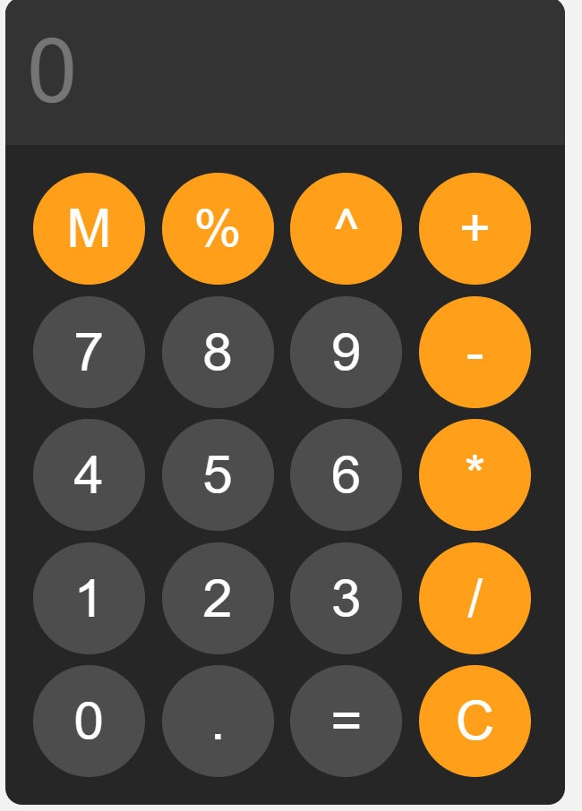

# 🧮 JavaScript Calculator

A simple and responsive calculator built using HTML, CSS, and JavaScript.

## ✨ Features
- Basic arithmetic operations (+, -, ×, ÷ , **, %)
- Clear all (C) and delete last digit (⌫)
- Responsive UI
- Clean and modern design

## 🛠 Tech Stack
- HTML  
- CSS  
- JavaScript  

## 📸 Screenshot


## ⚙️ Installation

```bash
git clone https://github.com/zaidbouallala/js-calculator.git
cd js-calculator
open index.html
